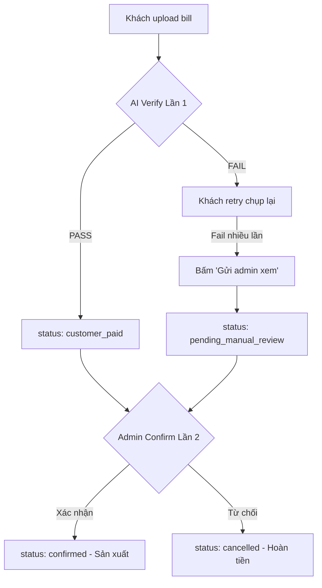

# Hướng Dẫn 2-Step Verification — Bếp Thuỷ Japan

> Tài liệu hướng dẫn quy trình xác minh thanh toán 2 bước cho khách hàng và admin.
> Cập nhật: 2026-05-02

---

## 1. Tóm Tắt Flow

Bếp Thuỷ Japan áp dụng quy trình **xác minh 2 bước (2-step verification)** cho mọi đơn hàng có upload bill chuyển khoản:

- **Lần 1 — AI verify (tự động)**: hệ thống AI đọc ảnh bill, kiểm tra số tiền, tên người nhận ("Thanghoang"), thời gian giao dịch.
- **Lần 2 — Admin manual confirm (thủ công)**: anh (admin) vào dashboard duyệt cuối cùng trước khi đơn vào sản xuất.

**Cả 2 bước đều phải PASS** thì đơn mới chuyển sang trạng thái `confirmed` và được đưa vào dây chuyền sản xuất. Đây là lớp bảo vệ kép: AI lọc 95% case rõ ràng, admin xử lý 5% edge case mà AI không chắc chắn.

**Lý do làm 2 bước**:
1. AI có thể sai (bill mờ, photoshop tinh vi, format ngân hàng lạ)
2. Tránh mất tiền nếu khách gian lận
3. Tránh sản xuất nhầm rồi không thu được tiền
4. Có audit trail để dispute sau này

---

## 2. Diagram Trực Quan

```
                       Khách upload bill
                              │
                              ▼
                  ┌─ AI VERIFY (Lần 1) ─┐
                  │                       │
                  │                       │
              ┌───┴───┐               ┌───┴───┐
              │ PASS  │               │ FAIL  │
              └───┬───┘               └───┬───┘
                  │                       │
                  ▼                       ▼
        status: customer_paid    Khách: retry chụp lại
                  │                       │
                  │                       ▼
                  │              (Nếu fail nhiều lần)
                  │              Button "📋 Gửi cho admin xem"
                  │                       │
                  │                       ▼
                  │              status: pending_manual_review
                  │                       │
                  └───────────┬───────────┘
                              ▼
                  ┌─ ADMIN CONFIRM (Lần 2) ─┐
                  │                           │
              ┌───┴───────┐           ┌───────┴───┐
              │ Xác nhận  │           │  Từ chối  │
              └───┬───────┘           └───────┬───┘
                  ▼                           ▼
        status: confirmed             status: cancelled
        (Vào sản xuất)                (Hoàn tiền + báo khách)
```

### Mermaid version



---

## 3. Cho Khách Hàng

### Khi nào AI verify FAIL?

AI sẽ báo fail nếu phát hiện:

| Lý do | Mô tả | Cách xử lý |
|-------|-------|------------|
| Bill bị crop | Cắt mất tên người nhận hoặc số tiền | Chụp lại toàn màn hình |
| Photoshop / chỉnh sửa | Phát hiện chỉnh sửa pixel | Dùng screenshot gốc, không edit |
| Số tiền sai | Khác với tổng đơn hàng | Kiểm tra lại đơn, chuyển đúng số |
| Tên người nhận không khớp | Không có "Thanghoang" | Chuyển đúng tài khoản PayPay |
| Bill quá cũ | Giao dịch > 7 ngày | Chuyển khoản lại |
| Ảnh mờ / xoay ngược | OCR không đọc được | Chụp rõ nét, dọc màn hình |

### Quy trình retry cho khách

1. **Lần 1 fail** → app hiện lý do AI từ chối (ví dụ: "Không tìm thấy chữ Thanghoang trong bill")
2. **Khách bấm "Thử lại"** → upload screenshot mới
3. **Lần 2 fail** → button **"📋 Gửi cho admin xem"** xuất hiện
4. Khách bấm submit → đơn vào diện `pending_manual_review`
5. Admin sẽ kiểm tra thủ công trong vòng **24 giờ** và phản hồi qua email/Zalo

### Tips chụp bill chuẩn

- Chụp **toàn màn hình** (full screenshot), không crop
- Đảm bảo nhìn thấy: số tiền + tên "Thanghoang" + thời gian + mã giao dịch
- Không zoom quá to làm vỡ ảnh
- Định dạng PNG hoặc JPG, dưới 5MB

---

## 4. Cho Admin (Anh)

### Quy trình hàng ngày

**Bước 1**: Đăng nhập vào https://thuythang.com/thuythang

**Bước 2**: Vào tab **"Đơn Hàng"**

**Bước 3**: Check 2 sub-tab quan trọng:

#### Sub-tab "🚨 Cần xem xét" (priority cao)

Đây là các đơn `pending_manual_review` mà AI fail nhưng khách yêu cầu admin xem.

Mỗi đơn em hiển thị:
- Ảnh bill khách upload (click để zoom)
- Lý do AI từ chối (ví dụ: "Số tiền 3500 yên không khớp với đơn 3520 yên")
- Thông tin đơn: SĐT khách, sản phẩm, tổng tiền
- 2 nút quyết định:

| Nút | Hành động | Status sau khi bấm |
|-----|-----------|---------------------|
| ✅ **Xác nhận thanh toán & sản xuất** | Bill OK (admin tự verify được) | `confirmed` → vào sản xuất |
| ❌ **Từ chối & hoàn tiền** | Bill có vấn đề thực sự | `cancelled` → hệ thống auto gửi message khách |

Khi từ chối, anh cần điền **lý do** vào textarea (sẽ gửi cho khách qua email).

#### Sub-tab "Đã thanh toán" (priority trung)

Các đơn `customer_paid` mà AI đã pass nhưng **chưa qua Admin confirm lần 2**.

- Hiển thị badge cảnh báo: **"⚠️ Chưa XN lần 2"**
- Anh nên check qua bill 1 lượt rồi bấm **"Xác nhận lần 2"** để chuyển thành `confirmed`
- Đơn ở trạng thái này quá 24h sẽ tự động chuyển sang sản xuất (nếu bật auto-confirm) — nhưng best practice là anh confirm thủ công

### Workflow gợi ý

- **Sáng (8h)**: check tab "🚨 Cần xem xét" — xử lý hết
- **Trưa (12h)**: check tab "Đã thanh toán" — confirm lần 2
- **Tối (20h)**: check lại tổng quan, đảm bảo không đơn nào quá 24h chưa xử lý

---

## 5. Hỗ Trợ Tools

### 🧪 Tab "Test Bill"

Tab này cho phép anh **debug AI verify** trước khi go-live, hoặc khi nghi ngờ AI sai:

1. Upload 1 ảnh bill bất kỳ (test fixture)
2. Hệ thống chạy verify như flow thật → trả về verdict + reason
3. Dùng để tinh chỉnh prompt AI hoặc kiểm tra edge case mới

### Manual Override Modal

Nếu AI verdict sai (ví dụ: AI fail nhưng bill thật sự OK):
- Bấm **"Override AI"** trong chi tiết đơn
- Nhập lý do override (bắt buộc)
- Verdict bị ghi đè + log vào `admin_audit_log`

### Telegram Alert Real-time

- Mỗi đơn `pending_manual_review` mới → bot Telegram ping anh ngay lập tức
- Nội dung: order_id, SĐT khách, tổng tiền, link admin
- Anh click link → vào thẳng modal duyệt

### Email Auto-send

- Khi có đơn `pending_manual_review` → email tự động gửi vào **thanghoang1109@gmail.com**
- Subject: `[BTJ] Đơn #ORDER_ID cần admin duyệt thủ công`
- Tránh sót đơn khi anh không ở app

---

## 6. Audit Trail

### Bảng `admin_audit_log`

Mọi action của admin đều được log lại để truy vết:

| Field | Mô tả |
|-------|-------|
| `id` | UUID auto-gen |
| `timestamp` | Thời gian action (UTC) |
| `admin_email` | Email admin (`thanghoang1109@gmail.com`) |
| `action_type` | `confirm` / `reject` / `override` |
| `order_id` | Đơn liên quan |
| `before_status` | Status trước khi action |
| `after_status` | Status sau khi action |
| `reason` | Lý do (text input từ admin) |
| `ai_verdict` | Snapshot verdict AI tại thời điểm đó |
| `bill_url` | Link ảnh bill gốc |

### Cách query audit log

- Vào tab **"Lịch Sử Admin"** trong dashboard
- Filter theo: order_id / action_type / date range
- Export CSV nếu cần dispute pháp lý

---

## 7. Edge Cases

### Edge case 1: Đơn manual_review > 7 ngày chưa xử lý

- UI highlight **đỏ extra** (border-red-500)
- Thêm tag "⏰ QUÁ HẠN 7 NGÀY"
- Telegram bot ping anh mỗi sáng 8h cho đến khi xử lý xong
- Không tự động cancel — phải có hành động thủ công

### Edge case 2: AI pass + admin confirm xong

- Đơn đã `confirmed` rồi → ko cần action gì thêm
- Tự động vào hàng sản xuất
- Em chỉ hiển thị ở tab "Đang sản xuất" / "Đang giao"

### Edge case 3: Khách dispute sau khi đã confirmed

Khách phản hồi: "Sao tôi không nhận được hàng / không chuyển khoản"

**Quy trình tra**:
1. Vào tab "Lịch Sử Admin" → search `order_id`
2. Xem audit log:
   - AI verdict tại thời điểm verify (có pass thật không?)
   - Bill khách upload (link `bill_url` còn không?)
   - Admin nào confirm + lý do
3. Đối chiếu với PayPay statement (download CSV từ PayPay merchant)
4. Phản hồi khách dựa trên evidence

### Edge case 4: AI fail liên tục cho 1 khách

Nếu 1 khách fail AI > 3 lần trong 24h:
- Hệ thống flag khách → tag "Suspicious"
- Tự động đẩy vào `manual_review` ngay từ lần submit thứ 4
- Anh nên check kỹ hơn (có thể là khách thật bill xấu hoặc fraud)

### Edge case 5: Admin confirm nhầm

Lỡ bấm "Xác nhận" nhầm đơn cancel:
- Vào audit log → tìm action gần nhất
- Bấm **"Revert"** (chỉ revert được trong 1h)
- Sau 1h: phải tạo manual override với lý do giải thích

---

## 8. Tóm Tắt 1 Phút

| Câu hỏi | Trả lời |
|---------|---------|
| Tại sao 2 bước? | AI lọc 95%, admin handle 5% edge case + giảm rủi ro mất tiền |
| Khách fail thì sao? | Retry chụp lại → fail tiếp thì gửi admin xem trong 24h |
| Admin check ở đâu? | /thuythang → tab Đơn Hàng → "🚨 Cần xem xét" + "Đã thanh toán" |
| Admin có quyền gì? | Confirm / Reject / Override AI + Revert trong 1h |
| Audit ở đâu? | Bảng `admin_audit_log` + tab "Lịch Sử Admin" |
| Đơn quá 7 ngày? | UI đỏ extra + Telegram ping mỗi sáng |

---

**File liên quan**:
- `HUONG-DAN-SETUP-AI-VERIFY.md` — setup AI prompt + threshold
- `HUONG-DAN-DEBUG-VERIFY.md` — debug khi AI sai
- `AUDIT-VERIFY-LAYERS.md` — kiến trúc kỹ thuật chi tiết
- `FIXTURES-PAYPAY-PATTERNS.md` — test fixture cho từng pattern bill
