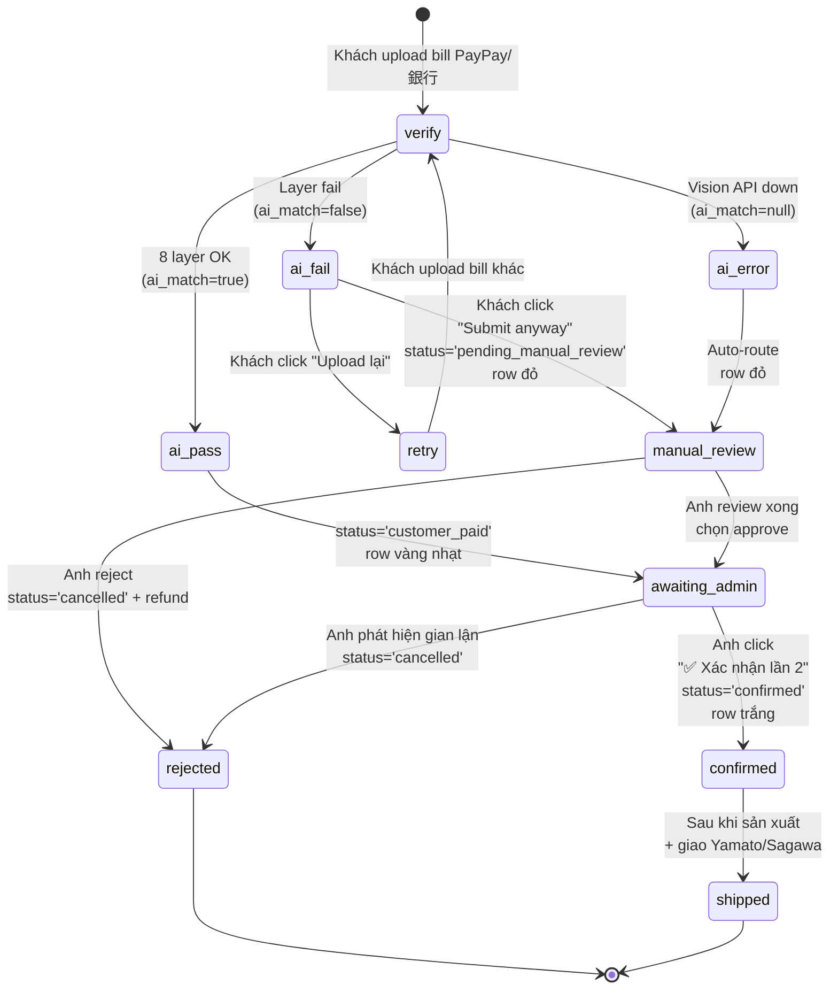

# SPEC — Quy trình xác minh thanh toán 2 bước (AI + Admin manual)

**Tác giả:** em (Claude) — viết theo yêu cầu của anh Thắng
**Ngày:** 2026-05-02
**Trạng thái:** Draft v1 — chờ anh duyệt rồi em mới code
**Phạm vi file ảnh hưởng:**
- `K:\bep-thuy-japan\thuythang.html` (admin dashboard UI + logic confirm)
- `K:\bep-thuy-japan\google-apps-script.js` (`verifyReceiptStandalone_` đã có sẵn — KHÔNG đổi)
- `K:\bep-thuy-japan\index.html` (form khách upload bill — UX khi AI fail)
- Migration SQL mới: `supabase-2-step-verify.sql` (3 cột mới)

---

## 0. Tại sao cần xác minh 2 bước?

Hiện tại flow chỉ có **1 lớp** — AI verify (`verifyReceiptStandalone_` 8 layer) chạy xong là đơn auto chuyển sang `customer_paid`. Vấn đề:

1. **AI có thể bị qua mặt**: Layer 1–8 dù chặt nhưng vẫn miss được — bill fake bằng Photoshop, bill cũ resubmit, bill amount đúng nhưng người nhận sai (anh đã gặp case ¥2,300 đến "Thanghoang" — không phải account chính).
2. **AI có false-positive**: Bill thật nhưng OCR đọc sai chữ "Thuỷ" → AI flag fail → khách bực vì đã trả tiền thật.
3. **Anh không có chốt cuối**: Hiện anh chỉ biết đơn `customer_paid` → ship. Nếu AI nhầm, anh ship hàng cho người không trả tiền → mất hàng.

**Giải pháp:** Thêm 1 bước **manual confirm bởi anh** sau khi AI pass. AI chỉ là "trợ lý" — quyết định cuối cùng vẫn do anh sau khi liếc ảnh bill 2 giây.

**Mục tiêu KPI:**
- 0% đơn ship sai (anh confirm xong mới ship).
- AI vẫn auto-pass 80%+ đơn → anh chỉ click "✅ Xác nhận" 1 lần / đơn (không phải đọc lại từng dòng).
- Đơn AI fail → highlight đỏ → anh xử lý ưu tiên.

---

## 1. State Machine — Vòng đời 1 đơn hàng

### 1.1. Mermaid state diagram



### 1.2. Bảng tóm tắt các state

| State (orders.status) | ai_match | admin_confirmed_at | Ý nghĩa | Hành động khách | Hành động anh |
|---|---|---|---|---|---|
| `pending` | NULL | NULL | Đơn vừa tạo, khách chưa upload bill | Upload bill | Chờ |
| `customer_paid` | true | NULL | AI pass, chờ anh xác nhận lần 2 | Chờ | **Xem ảnh + click XN** |
| `customer_paid` | true | NOT NULL → `confirmed` | Anh đã XN, sẵn sàng làm | Chờ ship | Sản xuất |
| `pending_manual_review` | false | NULL | AI fail, khách "submit anyway" | Chờ anh review | **Approve / reject** |
| `pending_manual_review` | NULL | NULL | Vision API down, route manual | Chờ | **Review thủ công** |
| `confirmed` | true/false | NOT NULL | Anh đã chốt, đang sản xuất | Chờ ship | Ship hàng |
| `shipped` | — | — | Đã giao Yamato/Sagawa | Chờ nhận | Done |
| `cancelled` | — | — | Reject / khách huỷ | Refund (nếu đã trả) | Done |

**Lưu ý quan trọng:**
- `customer_paid` chia làm **2 phase**: trước và sau khi `admin_confirmed_at` được set. Trong UI cần phân biệt rõ (xem section 3).
- `pending_manual_review` là state mới (anh đã thêm `'pending_manual_review'` vào enum check trong DB rồi — confirm lại trước khi code).
- Anh **chỉ được ship sau khi `status='confirmed'`** — KHÔNG ship khi `customer_paid` (vì chưa qua step 2).

---

## 2. Database Schema

### 2.1. Cột mới cần thêm

```sql
-- File: supabase-2-step-verify.sql

ALTER TABLE public.payment_confirmations
  ADD COLUMN IF NOT EXISTS admin_confirmed_at timestamptz,    -- Khi anh click XN (step 2)
  ADD COLUMN IF NOT EXISTS admin_confirmer text,              -- Email anh (audit trail)
  ADD COLUMN IF NOT EXISTS admin_notes text;                  -- Note tự do anh ghi (vd: "đối chiếu bank xong")

-- Index để query đơn chờ XN nhanh
CREATE INDEX IF NOT EXISTS idx_payment_conf_pending_admin
  ON public.payment_confirmations (admin_confirmed_at)
  WHERE admin_confirmed_at IS NULL;

-- Verify
SELECT column_name, data_type
FROM information_schema.columns
WHERE table_schema='public'
  AND table_name='payment_confirmations'
  AND column_name LIKE 'admin_%'
ORDER BY ordinal_position;
```

### 2.2. Cột đã có sẵn (chỉ liệt kê để tham chiếu)

Từ `supabase-ai-payment-verify.sql` (đã chạy):

| Cột | Kiểu | Ý nghĩa |
|---|---|---|
| `ai_verified_amount` | integer | Số tiền AI đọc được (¥) |
| `ai_match` | boolean | true=match, false=mismatch, null=Vision down |
| `ai_reason` | text | Lý do nếu fail (vd: "Layer 2 fail: tên người nhận không khớp") |
| `ai_verified_at` | timestamptz | Khi AI chạy xong |
| `ai_raw_text` | text | OCR text raw (debug) |
| `ai_confidence` | numeric(3,2) | 0.00–1.00 |

### 2.3. orders.status enum

Cần xác nhận `pending_manual_review` đã có trong CHECK constraint:

```sql
-- Check current allowed values
SELECT pg_get_constraintdef(oid)
FROM pg_constraint
WHERE conrelid = 'public.orders'::regclass
  AND conname LIKE '%status%';

-- Nếu chưa có 'pending_manual_review', chạy:
ALTER TABLE public.orders DROP CONSTRAINT IF EXISTS orders_status_check;
ALTER TABLE public.orders ADD CONSTRAINT orders_status_check
  CHECK (status IN ('pending','customer_paid','pending_manual_review','confirmed','shipped','delivered','cancelled'));
```

---

## 3. UI States — Trang admin (`thuythang.html`)

### 3.1. Order list — màu nền từng row

**Quy tắc tô màu (CSS class trên `<tr>`):**

| Điều kiện | Màu | CSS class | Ý nghĩa cho anh |
|---|---|---|---|
| `status='confirmed'` (anh đã XN xong) | Trắng | `row-confirmed` | OK rồi, không cần đụng |
| `status='customer_paid'` AND `admin_confirmed_at IS NULL` | Vàng nhạt `#fff8dc` | `row-pending-admin` | **Cần anh XN lần 2** |
| `status='pending_manual_review'` | Đỏ nhạt `#ffe5e5` | `row-needs-review` | **AI fail / Vision down — review gấp** |
| `status='pending'` (khách chưa upload bill) | Xám nhạt `#f5f5f5` | `row-no-bill` | Chờ khách trả tiền |
| `status='cancelled'` | Đỏ đậm + gạch ngang | `row-cancelled` | Đã huỷ |
| `status='shipped'` / `delivered` | Xanh lá nhạt `#e8f5e9` | `row-shipped` | Đã ship |

**Sort mặc định:**
1. `row-needs-review` (đỏ) lên đầu
2. `row-pending-admin` (vàng) thứ 2
3. `row-no-bill` (xám) thứ 3
4. `row-confirmed` / `row-shipped` xuống dưới

→ Anh mở dashboard → đập vào mắt là việc cần làm ngay.

### 3.2. Modal chi tiết đơn — section mới

Khi anh click 1 row, modal mở ra. Thêm 2 section mới ở đầu (trên cả "Sản phẩm"):

#### Section A: "🤖 Kết quả AI verify"

```
┌─────────────────────────────────────────────────┐
│  🤖 AI verify result                            │
├─────────────────────────────────────────────────┤
│  [✅ PASS]   Confidence: 0.95                   │
│  Số tiền đọc được: ¥2,300 (khớp với đơn)        │
│  Người nhận: ✓ Thuỷ Hoàng / Hoang Thi Thuy     │
│  Verified at: 2026-05-02 14:23                  │
│  [Xem ảnh bill ↓]  [Xem OCR raw ↓]              │
└─────────────────────────────────────────────────┘
```

Hoặc khi AI fail:

```
┌─────────────────────────────────────────────────┐
│  🤖 AI verify result                            │
├─────────────────────────────────────────────────┤
│  [❌ FAIL]   Confidence: 0.42                    │
│  Lý do: Layer 2 fail — tên người nhận           │
│         không khớp ("Thanghoang" ≠ "Thuỷ Hoàng")│
│  Số tiền đọc được: ¥2,300 (khớp đơn)            │
│  Verified at: 2026-05-02 14:25                  │
│  [Xem ảnh bill ↓]  [Xem OCR raw ↓]              │
└─────────────────────────────────────────────────┘
```

Badge:
- `PASS` → green pill `#4caf50`
- `FAIL` → red pill `#f44336`
- `ERROR` (Vision down) → orange pill `#ff9800` "Vision API không phản hồi"

#### Section B: "👤 Admin confirm (Step 2)"

**Khi `admin_confirmed_at IS NULL`** — hiện form:

```
┌─────────────────────────────────────────────────┐
│  👤 Xác nhận lần 2 (Anh)                        │
├─────────────────────────────────────────────────┤
│  Note (optional):                               │
│  ┌─────────────────────────────────────────┐   │
│  │ vd: "đã đối chiếu PayPay history"      │   │
│  └─────────────────────────────────────────┘   │
│                                                 │
│  [✅ Xác nhận đã trả tiền]  [❌ Reject + huỷ đơn]│
└─────────────────────────────────────────────────┘
```

**Khi `admin_confirmed_at IS NOT NULL`** — hiện summary:

```
┌─────────────────────────────────────────────────┐
│  👤 Đã xác nhận                                 │
├─────────────────────────────────────────────────┤
│  ✅ Confirmed by: thanghoang1109@gmail.com      │
│  Lúc: 2026-05-02 14:30                          │
│  Note: "đã đối chiếu PayPay history"            │
└─────────────────────────────────────────────────┘
```

### 3.3. Filter bar mới (đầu trang)

Thêm 4 quick filter button:

```
[ Tất cả (47) ] [ 🔴 Cần review (3) ] [ 🟡 Chờ XN (8) ] [ ⚪ Đã XN (36) ]
```

Click → filter rows theo state. Mặc định mở trang là "🔴 Cần review" (đỏ) lên đầu.

---

## 4. Decision Tree cho anh

Khi anh mở 1 đơn, follow flow này:

```
┌─────────────────────────────────────────────┐
│ Status đơn là gì?                           │
└─────────────┬───────────────────────────────┘
              │
        ┌─────┴─────┬──────────────┬──────────────┐
        ▼           ▼              ▼              ▼
   [confirmed]  [customer_   [pending_      [pending]
                 paid +      manual_         (chưa upload
                 chưa XN]    review]          bill)
        │           │              │              │
        ▼           ▼              ▼              ▼
   Không cần   1. Mở ảnh    1. Mở ảnh bill    Chờ khách
   làm gì.     bill         2. Đọc ai_reason  hoặc nhắc
   Chờ ship.   2. Liếc 2s   3. Đối chiếu      qua email
               3. Click XN  PayPay manual    /thanh-toan
                            4a. Nếu OK →
                                approve →
                                status=
                                confirmed
                            4b. Nếu fake →
                                reject →
                                cancelled +
                                refund
```

**Heuristic anh dùng để quyết approve/reject ở pending_manual_review:**

1. **AI fail amount** (Layer 1 — số tiền sai)
   → 99% là khách trả thiếu / dư → **email khách hỏi**, KHÔNG approve cũng không reject ngay.
2. **AI fail recipient** (Layer 2 — tên người nhận sai)
   → Có thể là OCR đọc nhầm → mở PayPay app/web check transaction history theo time + amount → nếu đúng có giao dịch thì **approve**.
3. **AI fail timestamp** (Layer 3 — bill quá cũ > 24h)
   → Nếu khách giải thích lý do (vd: order lại) → approve. Nếu im lặng → reject.
4. **AI fail duplicate** (Layer 4–8 — bill đã dùng cho đơn khác)
   → **Reject ngay**, đây là gian lận rõ.
5. **Vision API down** (`ai_match=null`)
   → Mở ảnh review tay y như thời chưa có AI.

---

## 5. Edge Cases

### 5.1. Vision API down giữa chừng

**Behavior:** `verifyReceiptStandalone_` catch exception → set `ai_match=null`, `ai_reason='Vision API error: <message>'`, route đơn về `pending_manual_review`.

**UI:** Modal hiện badge `[⚠️ ERROR]` orange + text "Vision API không phản hồi, vui lòng review thủ công".

### 5.2. Khách upload bill nhiều lần (resubmit)

**Vấn đề:** 1 order có thể có 2–3 record trong `payment_confirmations` (lần 1 fail, khách upload lại lần 2, etc.)

**Quy tắc:**
- Lưu **TẤT CẢ** record (không xoá / overwrite).
- Trong modal admin, hiện list "Lịch sử upload (3 lần)" với accordion expand từng lần — mỗi lần show ảnh + AI result riêng.
- Khi anh confirm/reject, áp dụng cho **record mới nhất** (`ORDER BY created_at DESC LIMIT 1`).
- Cột `ai_match` của order list dùng record mới nhất.

### 5.3. Anh confirm xong rồi khách dispute

**Scenario:** Anh đã click XN, sau đó khách gửi email "tôi không trả tiền đơn này, có người hack tài khoản tôi".

**Quy tắc:**
- KHÔNG cho phép edit / xoá `admin_confirmed_at` (immutable audit trail).
- Tạo cột `admin_disputed_at`, `admin_dispute_reason` trong `payment_confirmations` (TODO khi cần — chưa cấp bách).
- Hoặc đơn giản: anh ghi note vào `admin_notes` và đổi `orders.status='cancelled'` + xử lý refund tay.

### 5.4. AI pass nhưng anh phát hiện gian lận khi xem ảnh

**Scenario:** AI miss case bill Photoshop tinh vi.

**Behavior:** Anh click `[❌ Reject]` ở Section B → modal confirm "Bạn chắc chắn? Đơn sẽ bị huỷ và cần refund nếu đã có chuyển khoản về" → confirm → set `status='cancelled'` + ghi note vào `admin_notes` mô tả lý do.

### 5.5. Đơn cũ (trước khi triển khai feature) — backfill

**Vấn đề:** Đơn `customer_paid` cũ có `admin_confirmed_at IS NULL` → tự nhiên bị highlight vàng dù anh đã ship rồi.

**Giải pháp migration:**

```sql
-- Backfill: tất cả đơn đã shipped/delivered → coi như anh đã XN ngầm
UPDATE public.payment_confirmations pc
SET admin_confirmed_at = COALESCE(
      (SELECT shipped_at FROM public.orders o WHERE o.id = pc.order_id),
      pc.created_at
    ),
    admin_confirmer = 'system-backfill@bepthuy.local',
    admin_notes = 'Backfill: đơn đã ship trước khi triển khai 2-step verify'
WHERE admin_confirmed_at IS NULL
  AND order_id IN (
    SELECT id FROM public.orders WHERE status IN ('shipped','delivered','confirmed')
  );
```

### 5.6. Khách upload bill đúng lúc anh đang confirm đơn

**Race condition:** Anh mở modal đơn cũ (record 1), khách upload bill mới (record 2 vừa insert), anh click XN → XN gắn vào record 1 hay 2?

**Giải pháp:**
- Modal lưu `payment_confirmation_id` cụ thể anh đang xem (không lưu order_id chung).
- Khi anh click XN, gọi `confirmAdminPayment(payment_confirmation_id)` → update đúng record đó.
- Nếu trong khi anh xem, có record mới hơn → modal hiện banner "⚠️ Khách vừa upload bill mới, click để xem record mới nhất".

---

## 6. Implementation Checklist (cho lúc anh duyệt xong)

- [ ] Chạy `supabase-2-step-verify.sql` (3 cột mới + index)
- [ ] Backfill đơn cũ (section 5.5)
- [ ] Update `thuythang.html`:
  - [ ] CSS classes `row-confirmed`, `row-pending-admin`, `row-needs-review`, `row-no-bill`, `row-shipped`
  - [ ] Sort logic (đỏ → vàng → xám → trắng → xanh)
  - [ ] Filter bar 4 quick button
  - [ ] Modal Section A "AI verify result"
  - [ ] Modal Section B "Admin confirm (Step 2)"
  - [ ] Function `confirmAdminPayment(pc_id, notes)` — update `admin_confirmed_at`, `admin_confirmer`, `admin_notes` + đổi `orders.status='confirmed'`
  - [ ] Function `rejectAdminPayment(pc_id, notes)` — đổi `orders.status='cancelled'` + ghi note
  - [ ] Resubmit history accordion (5.2)
- [ ] Update `index.html` (form khách):
  - [ ] Sau khi AI fail, hiện 2 button: `[Upload lại]` và `[Submit anyway — chờ admin review]`
  - [ ] Click "Submit anyway" → set `status='pending_manual_review'`
- [ ] Update `google-apps-script.js`:
  - [ ] Đoạn handle Vision API exception → set `ai_match=null` + route `pending_manual_review` (kiểm tra đã có chưa)
- [ ] Test:
  - [ ] Đơn AI pass → anh XN → confirmed
  - [ ] Đơn AI fail → khách submit anyway → anh approve → confirmed
  - [ ] Đơn AI fail → khách submit anyway → anh reject → cancelled
  - [ ] Đơn Vision API down → manual_review → anh approve

---

## 7. Câu hỏi cần anh confirm trước khi code

1. **Email notification khi đơn vào `pending_manual_review`?**
   → Anh muốn em gửi email tới `thanghoang1109@gmail.com` mỗi lần có đơn fail, hay chỉ check dashboard manual?
2. **Auto-confirm threshold?**
   → Có muốn auto-set `admin_confirmed_at` khi `ai_confidence > 0.95` để anh không phải click? (em khuyên KHÔNG — defeats the purpose of step 2.)
3. **Reject có tự động email khách báo refund không?**
   → Hiện chưa có flow refund tự động — anh muốn em viết email template + button "Send rejection email" trong modal?
4. **Submit anyway** (khách bypass AI) — có cần thêm CAPTCHA hay rate-limit để chống spam?

---

**End of spec.** Anh đọc xong duyệt từng section, em mới code. Em không đụng code khi chưa có OK của anh.
