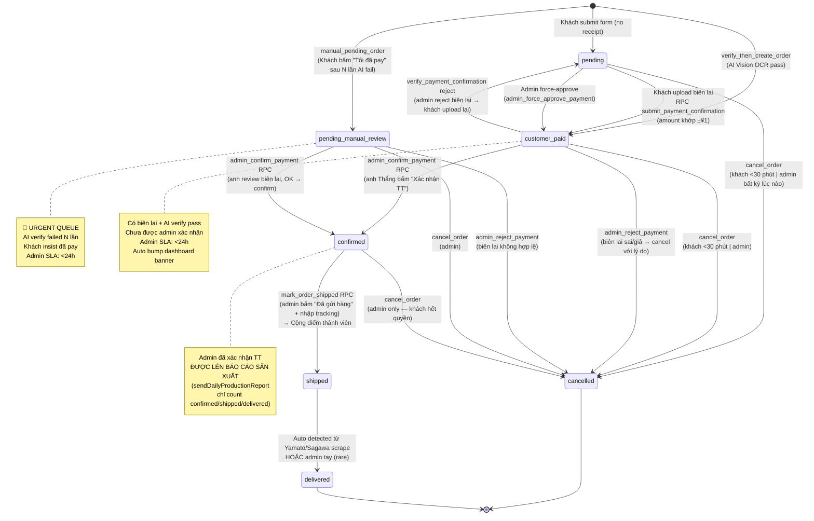
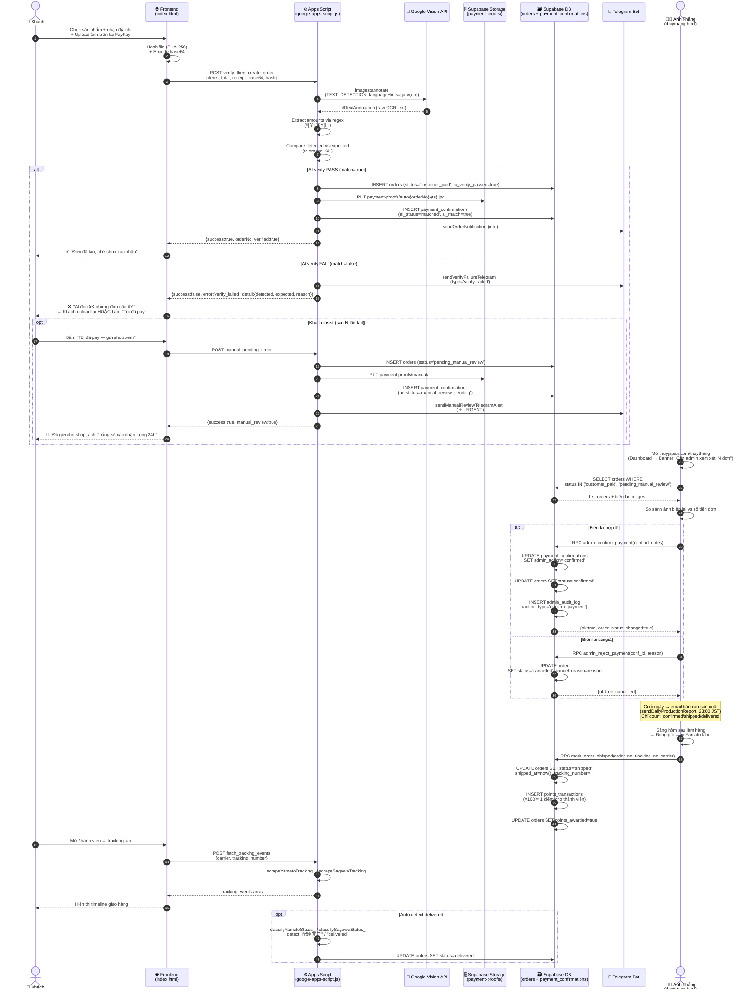

# Bếp Thuỷ Japan — Order Workflow & State Diagram

> **Last updated:** 2026-05-02
> **Mục đích:** Tài liệu tổng hợp toàn bộ vòng đời (lifecycle) của một đơn hàng — từ lúc khách bấm "Đặt hàng" tới khi nhận hàng — bao gồm tất cả các trạng thái (status), điều kiện chuyển trạng thái (transition triggers), các path xử lý lỗi (error paths), và Standard Operating Procedure (SOP) cho admin.
> **Đối tượng đọc:** anh Thắng (admin chính), staff phụ trợ trong tương lai, em (Claude) khi debug/audit, dev khi cần sửa code.
> **Source of truth:** logic trong `google-apps-script.js`, `supabase-2-step-verify.sql`, `supabase-payment-proof.sql`, `supabase-orders-migration.sql`, `supabase-customer-features.sql`, `thuythang.html`, `thanh-vien.html`.

---

## 1. State Diagram (Mermaid stateDiagram-v2)

Tất cả 7 trạng thái và mọi transition giữa các trạng thái. Trạng thái cuối (terminal/final) là `delivered` và `cancelled`.



### 1.1 Bảng tóm tắt transition (chi tiết)

| Từ trạng thái | Đến trạng thái | Trigger (RPC / Action) | Ai gây ra | Khi nào | Side effects |
|---|---|---|---|---|---|
| `(none)` | `pending` | `doPost` không có `receipt_base64` | Khách (legacy/fallback) | Submit form chưa upload biên lai | Tạo order, gửi email khách + admin, cộng điểm chờ |
| `(none)` | `customer_paid` | `verify_then_create_order` (AI verify pass) | Khách + Vision API | Submit form CÓ biên lai + AI OCR detect đúng số tiền | Tạo order, upload biên lai → Storage `payment-proofs/auto/`, tạo `payment_confirmations` row với `ai_status='matched'` |
| `(none)` | `pending_manual_review` | `manual_pending_order` (skip AI) | Khách | Sau N lần AI verify failed, khách bấm "Tôi đã thanh toán" | Tạo order, upload biên lai → `payment-proofs/manual/`, tạo `payment_confirmations` row với `ai_status='manual_review_pending'`, gửi Telegram URGENT alert |
| `pending` | `customer_paid` | `submit_payment_confirmation` RPC | Khách (sau khi đặt) | Upload biên lai từ trang `thanh-vien.html` (page "Đơn hàng") | Insert `payment_confirmations`, update order status |
| `pending` | `customer_paid` | `admin_force_approve_payment` | Admin | Khi admin manually duyệt biên lai mà AI từ chối (false negative) | Patch `payment_confirmations` (`ai_status='manual_approved'`), bump order |
| `pending` / `customer_paid` | `cancelled` | `cancel_order` RPC | Khách (`<30 phút`) hoặc Admin (any time) | Khách bấm "Hủy đơn" trong 30 phút đầu, hoặc admin bấm "Hủy" trong dashboard | Hoàn điểm đã dùng, set `note` ghi rõ ai hủy + lý do |
| `customer_paid` | `confirmed` | `admin_confirm_payment` RPC | Admin | Anh Thắng bấm "✅ Xác nhận thanh toán & sản xuất" trong order modal | Patch `payment_confirmations` (`admin_action='confirmed'`), insert `admin_audit_log` |
| `customer_paid` | `pending` | `verify_payment_confirmation` (legacy reject) | Admin | Admin reject biên lai → khách có quyền upload lại | Patch `payment_confirmations` (`status='rejected'`), revert order |
| `customer_paid` / `pending_manual_review` | `cancelled` | `admin_reject_payment` RPC | Admin | Biên lai sai/giả/không hợp lệ — không cho khách retry | Patch `payment_confirmations` (`admin_action='rejected'`), set `cancel_reason`, audit log |
| `pending_manual_review` | `confirmed` | `admin_confirm_payment` RPC | Admin | Admin review thủ công, OK → bypass AI | Same as above (RPC handles cả 2 status) |
| `confirmed` | `shipped` | `mark_order_shipped` RPC | Admin | Anh bấm "🚚 Đã gửi hàng" + nhập mã vận đơn (Yamato/Sagawa) | Set `shipped_at=now()`, **cộng điểm thành viên** (¥100 = 1 điểm), set `points_awarded=true` |
| `confirmed` | `cancelled` | `cancel_order` RPC (admin only) | Admin | Hết hàng, khách yêu cầu hủy sau 30 phút, etc. | Hoàn điểm đã dùng |
| `shipped` | `delivered` | Yamato/Sagawa tracking scrape | System (auto) hoặc admin tay | `scrapeYamatoTracking_` / `scrapeSagawaTracking_` detect "delivered" status | Update status |

---

## 2. Sequence Diagram — Order Placement → Verify → Confirm → Ship

Kịch bản chính (happy path): khách đặt hàng có biên lai PayPay/bank transfer, AI Vision verify pass, admin xác nhận, sản xuất, gửi hàng.



### 2.1 Error paths quan trọng (recap)

| Lỗi | Nơi xảy ra | Hệ thống xử lý |
|---|---|---|
| Vision API không đọc được text | `verifyReceiptWithAI_` | Trả `match=false`, reason="AI không đọc được text" → khách upload lại hoặc fallback manual |
| `screenshot_hash` đã dùng ở đơn khác | `submit_payment_confirmation` | Trả warning `hash_reuse_warning=true` (không block, cảnh báo admin trên dashboard) |
| Khách upload >3 lần / 1 đơn | `submit_payment_confirmation` | Block: "Đã đạt giới hạn 3 lần... liên hệ shop" |
| Số tiền lệch >¥1 | `submit_payment_confirmation` | Block trước khi insert: "Số tiền không khớp" |
| Storage upload fail (HTTP ≥300) | `savePaymentProofForVerifiedOrder_` | Log error, đơn vẫn được tạo (non-fatal) |
| Telegram bot down | `sendVerifyFailureTelegram_` | try/catch, log, không block flow chính |

---

## 3. Decision Tree — Admin Daily Workflow

Quy trình ngày làm việc của anh Thắng: từ lúc mở dashboard đến lúc đóng máy.

```mermaid
flowchart TD
    Start([☀️ Sáng — Anh mở<br/>thuyjapan.com/thuythang]) --> Login{Đăng nhập<br/>admin OK?}
    Login -->|No| LoginFail[❌ Báo lỗi<br/>kiểm tra Supabase auth]
    Login -->|Yes| Dashboard[📊 Dashboard tab<br/>load admin_stats_today]

    Dashboard --> CheckBanner{Banner đỏ<br/>"Cần admin xem xét"<br/>hiển thị?}
    CheckBanner -->|No total = 0| NoOrders[✅ Không có đơn cần duyệt<br/>→ Kiểm tra hàng cần ship]
    CheckBanner -->|Yes total ≥ 1| ClickReview[Click 'Xem ngay']

    ClickReview --> ReviewQueue[📋 Tab Orders<br/>→ Sub-tab 'Cần duyệt']
    ReviewQueue --> SortQueue[Sắp xếp: pending_manual_review<br/>TRƯỚC customer_paid]

    SortQueue --> PickOrder{Chọn đơn<br/>tiếp theo}
    PickOrder --> OpenModal[👁 Click vào đơn<br/>→ Open order modal]
    OpenModal --> ViewReceipt[Xem ảnh biên lai]
    ViewReceipt --> CheckAmount{Số tiền<br/>khớp đơn?}

    CheckAmount -->|Có khớp| CheckSource{Nguồn tiền<br/>hợp lệ?<br/>PayPay/Bank đúng tên}
    CheckAmount -->|Không khớp| Reject[❌ Click 'Reject'<br/>nhập lý do]

    CheckSource -->|Hợp lệ| Confirm[✅ Click<br/>'Xác nhận TT & sản xuất']
    CheckSource -->|Đáng nghi| AskCustomer[💬 Nhắn khách<br/>yêu cầu screenshot rõ hơn]

    Confirm --> RPCConfirm[RPC admin_confirm_payment<br/>→ status: confirmed]
    Reject --> RPCReject[RPC admin_reject_payment<br/>→ status: cancelled<br/>+ cancel_reason]

    RPCConfirm --> NextOrder
    RPCReject --> NotifyCustomer[💬 Tự động nhắn khách<br/>báo lý do reject]
    NotifyCustomer --> NextOrder
    AskCustomer --> WaitReply[⏸ Chờ khách reply<br/>→ skip đơn này]
    WaitReply --> NextOrder

    NextOrder{Còn đơn<br/>trong queue?}
    NextOrder -->|Yes| PickOrder
    NextOrder -->|No| ProductionReport

    NoOrders --> ProductionReport
    ProductionReport[📧 Email báo cáo sản xuất<br/>23h tối qua đã gửi auto<br/>→ Anh đọc + lên kế hoạch làm hàng]

    ProductionReport --> ShipDay{Hôm nay là<br/>ngày gửi hàng?<br/>Thứ 2 / 5 / Sat?}
    ShipDay -->|Yes| MakeProducts[🍳 Chế biến giò chả<br/>theo báo cáo]
    ShipDay -->|No| EndDay

    MakeProducts --> PrintLabels[🖨 In nhãn Yamato/Sagawa<br/>từ Sheet 'Yamato']
    PrintLabels --> ForEachShip[Cho từng đơn<br/>status=confirmed]
    ForEachShip --> MarkShipped[Click '🚚 Đã gửi hàng'<br/>nhập tracking_number]
    MarkShipped --> RPCShip[RPC mark_order_shipped<br/>→ status: shipped<br/>→ Cộng điểm thành viên]
    RPCShip --> MoreOrders{Còn đơn<br/>chưa ship?}
    MoreOrders -->|Yes| ForEachShip
    MoreOrders -->|No| EndDay

    EndDay([🌙 Hết ngày —<br/>System auto: báo cáo sản xuất 23h])

    style Start fill:#FFD700,color:#000
    style EndDay fill:#2C1A0E,color:#FFD700
    style CheckBanner fill:#EF4444,color:#fff
    style Confirm fill:#10B981,color:#fff
    style Reject fill:#EF4444,color:#fff
    style RPCShip fill:#7C3AED,color:#fff
```

---

## 4. Timeline / SLA — Vòng đời 1 đơn hàng (lý tưởng)

| T+ | Event | Actor | Trạng thái sau event | Ghi chú |
|---|---|---|---|---|
| **T+0:00** | Khách bấm "Đặt hàng" + upload biên lai PayPay | Khách | (đang submit) | Frontend hash + base64 encode |
| **T+0:05–0:30s** | AI Vision OCR + match amount | Vision API + GAS | `customer_paid` (nếu pass) | Gọi 1 API call ~0.5s, code logic ~5–25s tuỳ size ảnh |
| **T+0:30s** | Order created + biên lai uploaded → Storage | GAS + Supabase | `customer_paid` | Email confirm gửi khách + admin |
| **T+0:30s** | Telegram alert nếu fail | TG Bot | `pending_manual_review` (nếu fallback) | Rate-limited 1/5min/customer |
| **T+0:30s → 24h** | Đơn nằm trong **admin queue** (banner đỏ trên dashboard) | Admin (chờ) | `customer_paid` / `pending_manual_review` | **SLA target: <24h** |
| **T+<24h** | Admin xác nhận | Admin | `confirmed` | RPC `admin_confirm_payment` + audit log |
| **T+24–48h** | Cuối ngày — báo cáo sản xuất email | System (cron 23h JST) | `confirmed` | Anh lên plan làm hàng cho ngày mai |
| **T+24–48h** | Sáng hôm sau — chế biến + đóng gói | Admin | `confirmed` | Theo batch (vd: T2/T5/T7) |
| **T+24–48h** | In nhãn Yamato + ship | Admin | `shipped` | RPC `mark_order_shipped` → cộng điểm |
| **T+2–4 ngày** | Khách nhận hàng | Yamato/Sagawa | `delivered` | Auto-detect từ tracking scrape |

### 4.1 SLA mục tiêu

| Metric | Target | Hiện tại (đo được?) |
|---|---|---|
| AI verify time (95th percentile) | <30s | ~10–25s |
| Admin confirm time (medium) | <24h kể từ `customer_paid` | (đo qua dashboard banner: `customer_paid_count`) |
| Admin confirm time (`pending_manual_review`) | **<12h** (urgent) | URGENT Telegram alert |
| `confirmed` → `shipped` | 24–48h | Phụ thuộc batch ngày làm hàng |
| `shipped` → `delivered` | 2–4 ngày (Yamato Cool) | Phụ thuộc Yamato |

### 4.2 Cancellation deadline

| Ai hủy được | Khi | Trạng thái cho phép |
|---|---|---|
| **Khách** | Trong **30 phút** từ `created_at` | `pending`, `customer_paid` |
| **Admin** | Bất kỳ lúc nào | `pending`, `customer_paid`, `pending_manual_review`, `confirmed` |
| **Không ai** (đã quá muộn) | — | `shipped`, `delivered` (hard block) |

---

## 5. Status-Color Mapping (UI)

Mapping từ `status` enum sang badge color, icon, label hiển thị cho **admin** (`thuythang.html`) và **customer** (`thanh-vien.html`).

### 5.1 Admin dashboard (thuythang.html — function `statusBadge`)

| Status | CSS Class | Color (semantic) | Icon | Label (VN) | Ý nghĩa |
|---|---|---|---|---|---|
| `pending` | `badge-pending` | 🟡 Yellow | ⏳ | Chờ TT | Khách đặt nhưng chưa upload biên lai |
| `customer_paid` | `badge-paid` | 🔵 Blue | 💰 | Khách báo TT | Có biên lai + AI pass, **chờ admin xác nhận** |
| `pending_manual_review` | `badge-review` | 🔴 Red (urgent) | 🚨 | Cần admin xem xét | AI fail nhiều lần, khách insist — **URGENT** |
| `confirmed` | `badge-confirmed` | 🟢 Green | ✅ | Đã XN | Admin đã xác nhận, được tính báo cáo sản xuất |
| `shipped` | `badge-shipped` | 🟣 Purple | 🚚 | Đã gửi | Đã in nhãn + giao Yamato/Sagawa |
| `delivered` | `badge-delivered` | 🟢 Green | 📦 | Đã nhận | Khách đã nhận hàng |
| `cancelled` | `badge-cancelled` | ⚫ Gray | ❌ | Đã hủy | Đơn bị hủy (khách hoặc admin) |

### 5.2 Customer page (thanh-vien.html — `STATUS_BADGE`)

| Status | Tailwind classes | Icon | Label (VN, đối với khách) |
|---|---|---|---|
| `pending` | `bg-yellow-100 text-yellow-800 border-yellow-300` | ⏳ | Chờ thanh toán |
| `customer_paid` | `bg-blue-100 text-blue-800 border-blue-300` | 💰 | Đã chuyển — chờ xác nhận |
| `confirmed` | `bg-green-100 text-green-800 border-green-300` | ✅ | Đã xác nhận |
| `shipped` | `bg-purple-100 text-purple-800 border-purple-300` | 🚚 | Đã gửi |
| `delivered` | `bg-green-100 text-green-800 border-green-300` | ✓ | Đã giao |
| `cancelled` | `bg-gray-100 text-gray-600 border-gray-300` | ❌ | Đã huỷ |

> **Lưu ý:** Customer page (`thanh-vien.html`) **không có badge riêng cho `pending_manual_review`** — khách chỉ thấy `customer_paid` (label: "Đã chuyển — chờ xác nhận") để tránh tạo lo lắng. Chi tiết cờ "manual review" chỉ visible cho admin.

### 5.3 Tracking-tab status messages (khi chưa có `tracking_number`)

`thanh-vien.html` line 2577–2583 mapping status sang câu giải thích thân thiện cho khách:

| Status | Icon | Title | Body |
|---|---|---|---|
| `pending` | ⏳ | Đơn hàng chưa được thanh toán | Vui lòng hoàn tất thanh toán + gửi biên lai... |
| `customer_paid` | 💰 | Đang chờ shop xác nhận thanh toán | Anh/chị đã chuyển tiền — Bếp Thuỷ sẽ kiểm tra trong 24h... |
| `confirmed` | 🍳 | Đơn hàng chưa được vận chuyển | Bếp Thuỷ đã nhận thanh toán và đang chuẩn bị làm hàng... |
| `shipped` | 🚚 | Đơn đã gửi nhưng chưa cập nhật mã | Hàng đã được giao cho hãng vận chuyển... |
| `delivered` | ✅ | Đơn hàng đã giao thành công | Cảm ơn anh/chị! Mong anh/chị thưởng thức ngon miệng... |

---

## 6. Edge Cases — Những trường hợp lạ và cách hệ thống xử lý

### 6.1 Khách pay PayPay nhưng không submit form

**Tình huống:** Khách quét QR PayPay, chuyển tiền thành công, đóng tab. Không bao giờ submit form ở `thuyjapan.com`.

**Hệ quả:**
- Không có row nào trong `orders` table.
- Tiền đã vào tài khoản PayPay của shop → mismatch với hệ thống.

**Cách xử lý:**
1. Anh nhận tiền vào PayPay → check tên/SĐT → liên hệ khách qua Zalo/Telegram.
2. Yêu cầu khách quay lại submit lại (giải thích để hệ thống ghi nhận đúng).
3. Khi khách submit, AI sẽ verify ảnh biên lai cũ → pass → `customer_paid`.
4. **Hoặc** anh tạo đơn thủ công qua Apps Script (chưa có tool dedicated — TODO).

**Rủi ro:** Mất khách nếu họ ngại quay lại. **Mitigation:** Email/Zalo template sẵn để mời quay lại.

### 6.2 AI returns `verify_failed` nhưng đơn vẫn được tạo qua fallback

**Tình huống:** Khách upload biên lai → AI fail (vd: ảnh mờ, OCR không đọc được số) → khách bấm "Tôi đã pay — gửi shop xem" → `manual_pending_order` flow → đơn được tạo với `status='pending_manual_review'`.

**Hệ quả:**
- Order trong queue admin (banner đỏ).
- 2 row trong `payment_confirmations`: 1 row `ai_status='manual_review_pending'`, **không có** row `matched`.
- Telegram alert URGENT cho admin.

**Cách xử lý:**
1. Admin mở dashboard → banner đỏ → click "Xem ngay" → tab Orders → sub-tab "Cần duyệt".
2. Click vào đơn → modal mở ảnh biên lai → admin so sánh thủ công với PayPay merchant statement.
3. **Nếu đúng:** RPC `admin_confirm_payment` → `confirmed`.
4. **Nếu sai:** RPC `admin_reject_payment` với reason → `cancelled`.

**Audit trail:** Mọi action của admin lưu vào `admin_audit_log` với `action_type` = `confirm_payment` | `reject_payment`.

### 6.3 Admin reject → khách dispute (khiếu nại)

**Tình huống:** Anh reject biên lai (vd: nghi giả mạo) → đơn bị `cancelled`. Khách phản ứng: "Tôi đã chuyển thật, tại sao hủy?"

**Cách xử lý:**
1. Mở `admin_audit_log` → query theo `target_id = order_no` để xem lý do reject ban đầu.
2. Mở `payment_confirmations` row → check `ai_raw_text`, `ai_verified_amount`, `screenshot_url` để review lại bằng chứng.
3. Nếu khách cung cấp bằng chứng mới (vd: PayPay merchant transaction ID khớp với amount):
   - **Khách phải tạo đơn mới** (đơn cũ đã `cancelled`, không revert được).
   - Hoặc admin gọi `admin_force_approve_payment` lên 1 đơn pending mới của khách (work-around).
4. **Không có RPC un-cancel order** (by design — tránh nhầm lẫn). Nếu thật sự cần, sửa SQL trực tiếp + ghi audit log thủ công.

**Best practice:** Khi reject, **viết reason cụ thể** ("Số tiền 5000¥ không khớp đơn 8500¥. Khách upload nhầm screenshot?") để dễ giải thích sau này.

### 6.4 Khách upload đúng amount nhưng ảnh là biên lai cũ (đã dùng cho đơn khác)

**Tình huống:** Khách dùng cùng 1 ảnh biên lai PayPay cho 2 đơn.

**Hệ thống detect:**
- `submit_payment_confirmation` query `count(*) FROM payment_confirmations WHERE screenshot_hash = ? AND order_no <> ?`.
- Nếu >0, trả `hash_reuse_warning: true` (không block).

**Cách xử lý:**
- Admin thấy warning trên dashboard (TODO: implement banner — hiện tại chỉ log).
- Manual review: nếu confirmed dùng lại biên lai cũ → reject + cảnh báo khách.

**Limitation hiện tại:** Hash dedup chỉ chặn ở RPC `submit_payment_confirmation`. Path `verify_then_create_order` (Apps Script) **không check hash reuse** trước khi insert. → TODO: thêm check ở GAS side.

### 6.5 Khách hủy đơn ở phút 29 (cận deadline 30 phút)

**Tình huống:** Race condition — khách bấm hủy ở giây 29:55, hệ thống kiểm tra ở 30:01.

**Hệ thống:**
- `cancel_order` RPC check `v_order.created_at + interval '30 minutes' < now()` → nếu quá → reject.
- Atomic `for update` lock → không có race với admin confirm song song.

**Cách xử lý nếu khách báo "tôi bấm trước 30 phút mà bị reject":**
- Check timestamp trong audit log + Supabase logs.
- Admin có thể hủy thay (admin không bị giới hạn 30 phút).

### 6.6 Đơn `confirmed` nhưng hết hàng

**Tình huống:** Anh đã confirm đơn nhưng tới ngày làm hàng phát hiện hết nguyên liệu / không kịp sản xuất.

**Cách xử lý:**
1. Admin gọi `cancel_order(order_no, "Hết hàng — xin lỗi anh/chị, hoàn tiền qua PayPay")`.
2. Hệ thống set `status='cancelled'`, hoàn `points_used` (nếu có).
3. **Hoàn tiền PayPay phải làm thủ công** ngoài hệ thống — Apps Script không tự refund.
4. Nhắn khách qua messaging system (`message_threads`) báo + gửi PayPay refund receipt.

### 6.7 Yamato tracking báo "Delivered" nhưng khách báo chưa nhận

**Tình huống:** Tracking scrape detect "配達完了" → auto-update `status='delivered'`. Khách Zalo: "Em chưa nhận được."

**Cách xử lý:**
1. Check tracking events chi tiết trong dashboard (admin tab tracking).
2. Khách kiểm tra hàng xóm / hộp thư chung / cửa apartment lobby.
3. Nếu thật sự mất → liên hệ Yamato 0120-01-9625 → claim insurance.
4. **Status không revert** từ `delivered` → tạo đơn mới đền (free hoặc voucher).

---

## 7. Admin SOP (Standard Operating Procedure)

### 7.1 ☀️ Daily Morning Routine (5–15 phút)

**Trước khi bắt đầu ngày làm việc**, anh làm các bước sau theo thứ tự:

1. **Mở dashboard:** `https://www.thuyjapan.com/thuythang` → đăng nhập.
2. **Check banner đỏ** "🚨 Cần admin xem xét: N đơn".
   - Nếu N=0 → skip step 3.
   - Nếu N≥1 → bấm "Xem ngay".
3. **Process review queue** (theo thứ tự ưu tiên):
   - **🚨 `pending_manual_review` trước** (URGENT, SLA <12h).
   - **💰 `customer_paid` sau** (SLA <24h).
   - Cho từng đơn:
     a. Click vào đơn → mở modal.
     b. Xem ảnh biên lai → so với PayPay merchant statement (mở app PayPay riêng).
     c. **Nếu đúng:** Click "✅ Xác nhận thanh toán & sản xuất".
     d. **Nếu sai:** Click "❌ Hủy đơn" → nhập reason cụ thể (vd: "Số tiền 5000¥ không khớp đơn 8500¥").
     e. **Nếu đáng nghi nhưng chưa chắc:** Click "💬 Báo TT" → nhắn khách yêu cầu screenshot rõ hơn → skip đơn này → quay lại sau.
4. **Check tab "Tin nhắn"** — reply khách nếu có (khoảng 1–2 đơn/ngày).
5. **Đóng máy / chuyển sang việc khác.**

**🎯 KPI:** Banner đỏ về 0 trước 11h trưa hàng ngày.

### 7.2 📦 Each Batch Shipping Day (T2 / T5 / T7 — lịch riêng của anh)

**Tối hôm trước (23h)** — anh nhận **email báo cáo sản xuất** tự động (sendDailyProductionReport):
- Liệt kê từng sản phẩm + tổng số kg/túi/hộp cần làm.
- Chỉ count đơn `confirmed` / `shipped` / `delivered` (đã trừ cancelled, pending, customer_paid).

**Sáng ngày shipping:**
1. **Đọc email báo cáo sản xuất** → in ra giấy / mở trên iPad.
2. **Chế biến + đóng gói** từng sản phẩm theo số lượng tổng.
3. **Phân bổ vào từng đơn** (manually — kiểm theo địa chỉ ship).
4. **Mở dashboard → tab Orders → filter `confirmed`**.
5. **Cho từng đơn:**
   a. Click "🚚 Đã gửi hàng" trong order modal.
   b. Nhập `tracking_number` (Yamato Cool 12 chữ số / Sagawa 12 chữ số).
   c. Chọn carrier dropdown (Yamato / Sagawa).
   d. Click Save → RPC `mark_order_shipped` → status `shipped` → **cộng điểm thành viên tự động**.
6. **In nhãn Yamato:** Mở Sheet `Yamato` → in các dòng có "Da TT - Cho gui" → dán lên hộp.
7. **Gọi Yamato pickup:** 0120-01-9625 → đặt giờ pickup.

**🎯 KPI:** Tất cả đơn `confirmed` được ship trong ngày → status `shipped` → email tracking cho khách.

### 7.3 📊 Weekly Review (Chủ Nhật, ~30 phút)

**Mỗi cuối tuần:**

1. **Mở Dashboard** → tab "Phân tích" / "Stats":
   - Tổng đơn tuần này.
   - Doanh thu tuần.
   - Top 5 sản phẩm bán chạy.
   - Số khách mới vs khách quay lại.
2. **Check `admin_audit_log`** — query lệnh sau trong Supabase SQL editor:
   ```sql
   SELECT created_at, admin_email, action_type, target_id, details->>'reason' AS reason
   FROM public.admin_audit_log
   WHERE created_at > now() - interval '7 days'
   ORDER BY created_at DESC;
   ```
   - Review các `reject_payment` action — có pattern gì lặp lại không?
3. **Check `pending_manual_review` count** — query:
   ```sql
   SELECT count(*) FROM public.orders
   WHERE status = 'pending_manual_review'
     AND created_at > now() - interval '7 days';
   ```
   - Nếu >5 đơn/tuần → có thể AI verify đang gặp vấn đề (ảnh format mới, regex không match...) → check log.
4. **Inventory check** (Inventory tab).
5. **Review messaging** — có khách nào hỏi mà chưa reply quá 48h không?
6. **Plan tuần sau:**
   - Lịch shipping (thường T2/T5/T7).
   - Sản phẩm cần thêm/bỏ.
   - Email campaign nào sắp gửi.

### 7.4 🚨 Emergency Procedures

| Tình huống | Bước xử lý nhanh |
|---|---|
| **Telegram alert URGENT** giữa đêm | Chỉ cần ack — confirm vào sáng hôm sau. SLA <12h cho `pending_manual_review`. |
| **Khách Zalo gấp** (vd: cần hủy đơn confirmed) | Mở dashboard → tìm đơn → Cancel (admin override) → message khách đã hủy. |
| **AI Vision API down** (Vision returns 5xx) | Verify path sẽ throw → fallback `manual_pending_order` tự kích hoạt → admin queue tự fill. Không cần action. |
| **Supabase down** | Apps Script vẫn nhận form submit (data lưu Sheet). Đơn không vào DB → **TODO:** retry queue (chưa implement). |
| **Khách dispute reject** | Mở `admin_audit_log` → tìm reason cũ → so với bằng chứng mới → tạo đơn mới đền nếu sai sót. |

---

## 8. Phụ lục — Files & RPCs liên quan

### 8.1 SQL files (source of truth)

| File | Vai trò |
|---|---|
| `supabase-orders-migration.sql` | Schema gốc của `orders` table + status enum. RPC `mark_order_shipped`. |
| `supabase-payment-proof.sql` | `payment_confirmations` table + RPC `submit_payment_confirmation` (khách upload biên lai). |
| `supabase-2-step-verify.sql` | RPC `admin_confirm_payment` + `admin_reject_payment` + `admin_audit_log` table + RLS policies. |
| `supabase-customer-features.sql` | RPC `cancel_order` (cho cả khách + admin) + messaging schema. |
| `supabase-admin-migration.sql` | Admin users + admin_stats_today view + extended `mark_order_shipped`. |
| `supabase-tracking-shipping.sql` | `mark_order_shipped` v2 với tracking_number, carrier, tracking_url. |

### 8.2 Apps Script handlers (`google-apps-script.js`)

| Handler `data.type` | Chức năng |
|---|---|
| `verify_then_create_order` | AI verify ảnh biên lai → nếu pass thì tạo order `customer_paid`. |
| `manual_pending_order` | Skip AI verify, tạo order `pending_manual_review` cho admin xem xét. |
| `admin_force_approve_payment` | Admin override khi AI false-negative. |
| `verify_dry_run` | Test AI verify mà không tạo order (debug). |
| `send_production_report` | Gửi email báo cáo sản xuất theo date range. |
| `fetch_tracking_events` | Scrape Yamato/Sagawa tracking page → trả events. |

### 8.3 Frontend pages

| Page | Người dùng | Chức năng chính liên quan tới order workflow |
|---|---|---|
| `index.html` | Khách | Đặt hàng + upload biên lai PayPay/bank → gọi `verify_then_create_order`. |
| `thanh-vien.html` | Khách (đã đăng nhập) | Xem lịch sử đơn, hủy đơn (`cancel_order`), upload biên lai bổ sung (`submit_payment_confirmation`), tracking. |
| `thuythang.html` | Admin (anh Thắng) | Dashboard, review queue, confirm/reject, ship, cancel, audit log, inventory. |

---

## 9. Glossary (thuật ngữ)

- **AI verify:** OCR ảnh biên lai bằng Google Vision API → extract số tiền → so với order total.
- **Manual review:** Admin xem xét thủ công khi AI verify fail nhiều lần.
- **Force approve:** Admin override khi AI false-negative (biên lai thật nhưng AI không đọc được).
- **2-step verify:** Workflow gồm (1) AI auto-verify khi khách submit, (2) admin manual confirm — đảm bảo không có đơn nào "tự động" được duyệt 100%.
- **SLA:** Service Level Agreement — cam kết thời gian xử lý.
- **Audit log:** Ghi nhận immutable mọi action của admin (`admin_audit_log` table) — không thể UPDATE/DELETE qua PostgREST.
- **`points_awarded`:** Flag boolean trên order — đảm bảo điểm thành viên chỉ cộng 1 lần (không double-award).
- **`screenshot_hash`:** SHA-256 của ảnh biên lai — dùng để detect khách dùng lại ảnh cũ.

---

**End of document.** Nếu có thay đổi schema/workflow trong tương lai, anh nhớ update file này song song với code.
